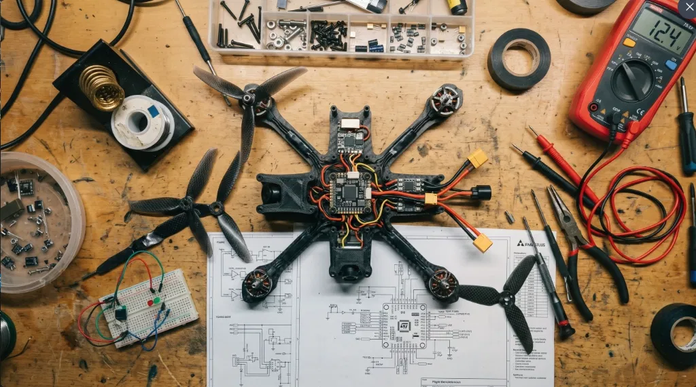

# Vyoma: Semantic Drone Autopilot


[](https://docs.ros.org/en/humble/)
[](https://px4.io/)
[](https://developer.nvidia.com/embedded/jetson-nano-developer-kit)
[](LICENSE)
[]()

A ground-up autopilot stack for semantically-aware, edge-deployed autonomous flight. Rather than treating navigation as pure geometric obstacle avoidance, this system fuses camera and LiDAR modalities through deep learning so the drone reasons about *what* it sees, not just *where* things are — distinguishing a person from a tree, a wire from open air, a rooftop from a hazard.

Designed for real-world deployment on an **NVIDIA Jetson Nano**, the stack is built on **ROS 2 Humble**, **Nav2**, and **PX4**, targeting complex missions in dynamic, unmapped, and unstructured environments where classical waypoint-following autopilots fail.

---

## Why Semantic Autonomy

Traditional autopilots treat every obstacle identically: a wall, a pedestrian, and a mailbox all just occupy a costmap cell. This is unsafe and inefficient — a drone should keep a far wider berth from a person than from a bush, and should actively seek out flat, human-free terrain when landing autonomously. This project closes that gap by injecting class-aware semantic understanding directly into the navigation stack, not as an afterthought bolted onto perception, but as a first-class signal in path planning and landing-site selection.

---

## System Architecture

The stack is organized into three tightly-coupled layers, each independently testable in simulation before hardware deployment.

### 1. Perception & Sensing Layer
- **Semantic Vision (Camera + YOLOv8):** Real-time semantic segmentation and object detection via an optimized YOLOv8 model (`yolov8n-seg.pt`), quantized for Jetson-class inference. Classifies people, vehicles, foliage, structures, and viable landing zones frame-by-frame.
- **LiDAR Sensing:** High-resolution 2D/3D point cloud processing for immediate, precise obstacle detection — including thin, vision-invisible hazards like power lines and guy wires — and construction of local occupancy grids.
- **Sensor Fusion:** Time-synchronized fusion of semantic masks with LiDAR range data, projecting 2D class labels into a consistent 3D spatial map via calibrated extrinsics.

### 2. Navigation & Topology Layer
- **Semantic Nav2 Costmap:** A custom Nav2 costmap plugin (`semantic_layer.cpp`) that ingests semantic-fused point clouds and applies per-class inflation radii and cost weighting — enabling behaviors like "avoid humans by 5m, trees by 1m" as a declarative policy rather than hardcoded logic.
- **Topology & Terrain Mapping:** Continuous terrain modeling from LiDAR + vision to support contour-following flight and autonomous identification of flat, obstruction-free landing candidates, ranked by slope, roughness, and semantic clearance.
- **Altitude & Z-Axis Control:** Dedicated altitude-hold and vertical velocity control loops tuned for stability across varying terrain, with smooth descent profiles for precision landing.

### 3. Control & Hardware Layer
- **PX4 Flight Stack Integration:** Industry-standard PX4 firmware handles low-level motor mixing, stabilization, and failsafe logic, decoupling high-level autonomy from flight-critical control.
- **Micro XRCE-DDS Bridge:** Low-latency, real-time bridge between ROS 2 decision-making nodes and the PX4 flight controller.
- **Edge Optimization:** Inference and point cloud pipelines are profiled and optimized specifically for the Jetson Nano's Maxwell GPU and ARM CPU — model quantization, frame skipping under load, and asynchronous pipeline staging keep the control loop within real-time bounds.

---

## Project Structure

```text
semantic_drone_project/
├── Dockerfile                  # Containerized Ubuntu 22.04 + ROS 2 Humble environment
├── run_docker.sh               # Build and launch the dev container (with X11 forwarding)
├── setup_simulation.sh         # Clone and build PX4 SITL
├── yolov8n-seg.pt              # Base YOLOv8 Nano segmentation weights
├── simulation/
│   ├── models/                 # Custom Gazebo models (Quadcopter, Camera, LiDAR)
│   └── worlds/                 # Custom Gazebo simulation worlds (topology testing)
└── src/
    ├── semantic_nav_pkg/       # C++ ROS 2 package: Nav2 plugins, LiDAR processing, topology
    └── semantic_vision_pkg/    # Python ROS 2 package: YOLO inference, camera feeds
```

---

## Getting Started (Simulation)

The full environment is containerized to eliminate ROS 2 dependency conflicts across host systems (particularly relevant for non-Ubuntu developers, e.g. Arch Linux).

### Prerequisites
- Docker installed and running
- An X11 server for GUI forwarding (Gazebo rendering)
- 8GB+ RAM recommended for SITL + Gazebo + inference concurrently

### Installation

1. **Clone the repository:**
   ```bash
   git clone https://github.com/yourusername/semantic_drone_project.git
   cd semantic_drone_project
   ```

2. **Build and launch the development container:**
   ```bash
   chmod +x run_docker.sh
   ./run_docker.sh
   ```
   X11 forwarding is handled automatically inside the script.

3. **Set up PX4 SITL** (inside the container):
   ```bash
   chmod +x setup_simulation.sh
   ./setup_simulation.sh
   ```

4. **Build the ROS 2 workspace:**
   ```bash
   colcon build
   source install/setup.bash
   ```

---

## Roadmap & Current Status

- [x] Dockerized ROS 2 Humble environment configuration
- [x] PX4 SITL & Gazebo build scripts
- [ ] Micro XRCE-DDS bridge setup & telemetry verification
- [ ] YOLOv8 vision node (camera subscription & mask publishing)
- [ ] LiDAR point cloud processing node
- [ ] Topology mapping & altitude control logic
- [ ] Nav2 semantic costmap integration
- [ ] Hardware deployment (Jetson Nano + Pixhawk)
- [ ] Real-world flight testing

---

## Contributing

Issues and PRs are welcome, particularly around costmap plugin performance, Jetson inference optimization, and simulation world diversity. Please open an issue before submitting large architectural changes.

## License

This project is licensed under a Proprietary License — see the [LICENSE](LICENSE) file for details. All rights reserved.

---

## Author

**Rahul**
B.Tech, Computer Science & Engineering (AI & Data Science) — IIIT Manipur
Building **Sutra**, a production RAG knowledge assistant, at IIT Roorkee's Academic Affairs Department
Author of **VidChain** (multimodal video RAG library, published on PyPI)

> *"The next frontier in robotics isn't just navigating the world—it's understanding it."*